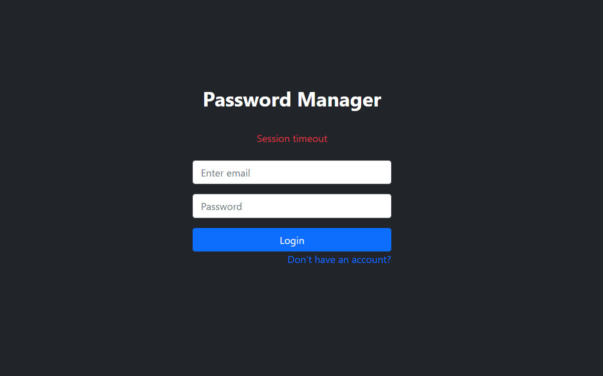
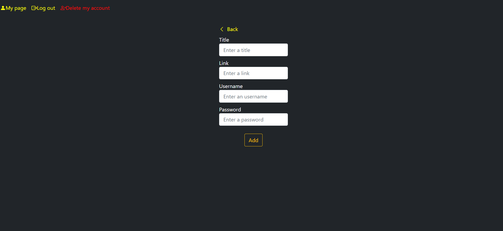
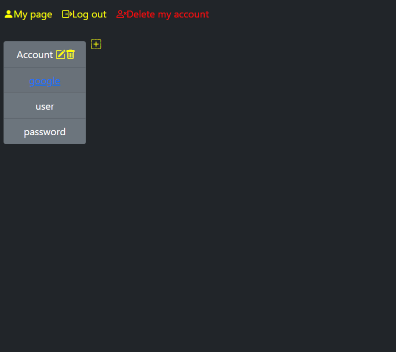
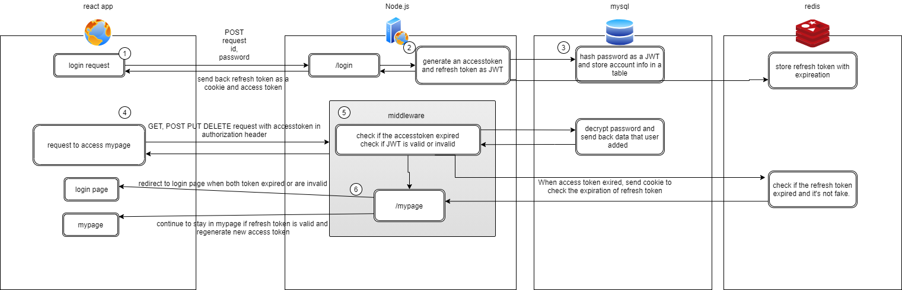

# PasswordManager
This is a web app to manage your password.
 
JWT,access token and refresh token are used in this app.
 
Once you sign in your mypage, automated login are going to be activated for 15 minutes.
 
Expiration for refresh token is set up for 30 minutes.
After 15 minutes pass by, new access token are issued and the expiration for refresh token are renewed unless you take no actions at all.      

# Live project
http://password-manager-livid.vercel.app/

# Sample image
 
 

# Why I built this app? 
I didn't exactly grasp the data flow of token authentication and how JWT works. I wanted to build a good foundation of the basics of authentication by working on projects by myself.

# Architecture
I built the data flow to have features for token authentication.
While access token is valid, user can log in automatically.

# What I Learnt 
I was able to learn the basic authentication system. This is my first authentication project. I was happy to grash the understandings of where to store and manage both token(e.g. cookie or local storage in frontend), how privacy data should be more secure and why exactly JWT is used.  

* Token authentication
* JWT
* Basic usage of redis
* Encryption and decryption for password
* Basic cryptography 

# Project Difficulties
I couldn't grasp how refresh token works and how each request and response has to be authorized at first. I searched quite a lot of articles on the internet and learnt from those resorces enough. In addition to those things, I checked the system in a frontend side,backend side separately. In the backend side, I especially utilized a rest api testing quite enough. I finally was able to see the big picture.

# Tech stack 
frontend 
*  HTML
*  CSS
*  Bootstrap 
*  React
*  Typescript

backend 
*  Node.js
*  Typescript 
*  Postman
*  Redis
*  MySQL
*  Jest
*  JWT
*  PM2 (Used in a production environment)
